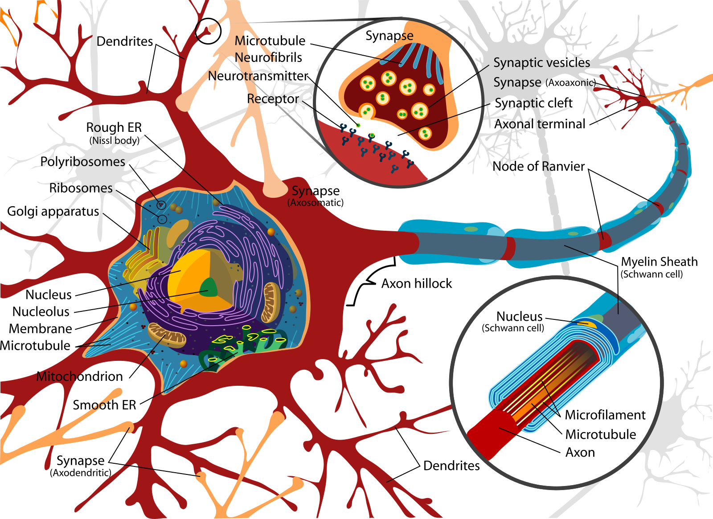
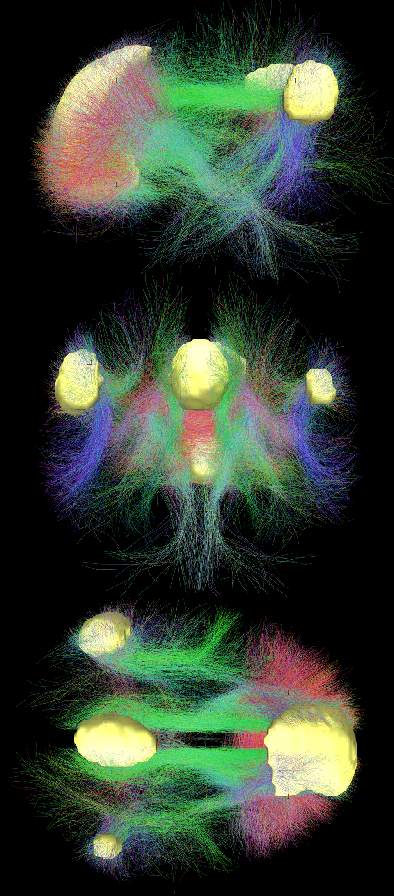
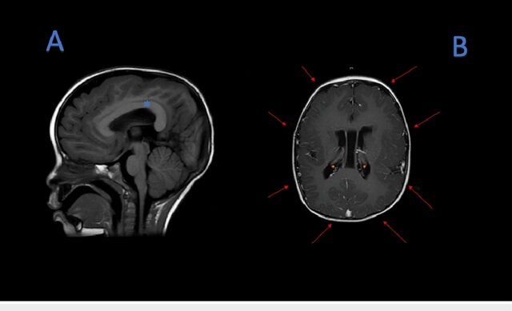
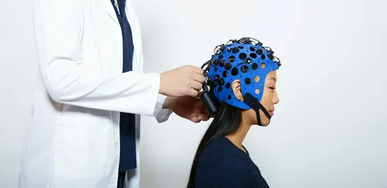

# Lecture Notes

## Brain Structure

**Microscale**  
Neurons and glia; myelin speeds conduction; demyelination impacts function.  

**Macroscale**  
Cortex, cerebellum, brainstem, corpus callosum. Distributed networks enable cognition (often small-world & modular).

### Neuron Anatomy

  
*This diagram shows the soma (with nucleus, nucleolus, mitochondria, rough/smooth ER), dendrites with synapses, and the axon hillock extending into a myelinated axon with Schwann cells and nodes of Ranvier. It highlights how neuronal structure supports electrical excitability and chemical transmission.*

### Default Mode Network (DMN)

  
*Default Mode Network regions from a literature review.*

  
*Main regions of the DMN (yellow) and connectivity between them color-coded by structural traversing direction (xyz → rgb).*

## Modality Cheat-Sheet

| Modality | Measures | Temporal | Spatial | Invasiveness | Typical Uses |
|-|-|-|-|--|--|
| Structural **MRI** (T1/T2/FLAIR) | Anatomy | — | **mm** | Non-invasive | Tumors, morphometry, tract context |
| **CT** | X-ray density | — | mm | Ionizing | Acute bleed, bone |
| **fMRI (BOLD)** | Hemodynamic proxy | **s** | **mm** | Non-invasive | Cognitive mapping, resting-state |
| **EEG** | Scalp voltages | **ms** | cm (inverse-limited) | Non-invasive | Fast dynamics, oscillations, BCIs |
| **MEG** | Magnetic fields | **ms** | ~cm | Non-invasive | Millisecond timing + decent localization |
| **fNIRS** | Hemoglobin changes | s | cm (surface) | Non-invasive | Bedside, pediatrics |
| **PET** | Radiotracers | min | mm–cm | Radioactive | Molecular targets |

### Example Images

**MRI**

  
*Magnetic Resonance Imaging (MRI) scanner. Non-invasive technique using magnetic fields and radiofrequency pulses to produce high-resolution images of soft tissues.*

  
*(A) MRI T1 sequence, thickening of the corpus callosum (blue asterisk). (B) MRI T1 sequence, pachygyria (red arrows), subependymal neuronal heterotopias (orange asterisk).*

**EEG**

  
*EEG cap placement. Non-invasive scalp electrodes allow recording of brain oscillations with millisecond resolution.*

  
*EEG analysis pipeline: preprocessing → filtering into frequency bands (δ, θ, α, β, γ) → source localization → Hilbert envelopes → functional brain networks.*

## Pipeline for Neuroimaging ML

1. **Acquisition** → metadata (TR/slice timing, channel montage, filters)  
2. **Pre-processing**  
   - *MRI/fMRI*: motion, slice timing, distortion, co-registration, normalization; denoise confounds  
   - *EEG/MEG*: filtering, bad channels, ICA/SSP for EOG/EMG/ECG, re-reference, epoching  
3. **Features**  
   - *MRI*: volumes, cortical thickness/shape, tractography; parcellation → connectomes  
   - *fMRI/EEG/MEG*: GLMs; resting-state networks; spectra (α, β, γ), ERPs/ERFs; connectivity (coherence/PLV)  
4. **Models**: regularized ML for low-N/high-D; deep nets for large cohorts or with SSL  
5. **Validation**: subject/site CV; leakage control; pre-registered metrics  
6. **Interpretation**: saliency in brain space; ROI ablations; uncertainty

## Case Vignettes

- **Sleep & Memory** — Spindles/slow waves show distinct hemodynamic correlates; selective processing persists in light NREM.  
- **Resting-State (DMN)** — Task-negative network; subject fingerprints; predicts task recruitment.  
- **Language** — Wernicke (comprehension) & Broca (production/structure) with task/multimodal activations.  
- **Reward** — Basal ganglia & midline cortices track reward type/value; shared cores + specific patterns.  
- **BCIs** — Intracortical arrays can control robotic arms (e.g., BrainGate2).

## Visual Extras

.png)  
*Transcranial Magnetic Stimulation (TMS). A magnetic coil placed over the scalp generates a magnetic field that induces an electric current in underlying cortical tissue. Depending on coil placement, regions such as the motor cortex or dorsolateral prefrontal cortex can be selectively stimulated.*

## Practical Design Patterns for Clinics

- **If task performance is impossible**: use resting-state fMRI to predict task maps; validate with intra-op mapping if available.  
- **Focal epilepsy**: semi-auto lesion segmentation with radiologist-in-the-loop weak labels.  
- **EEG for depression**: multichannel features (band powers, asymmetry, coherence/PLV), robust subject-wise CV, site harmonization.  
- **Neuroeducation**: start with eye-tracking + behavior; add EEG/fMRI on subsets for latent-state modeling.

## References

- Huneau, 2015 — [Link](https://pmc.ncbi.nlm.nih.gov/articles/PMC4683196/)  
- Hillman, 2014 — [Link](https://pmc.ncbi.nlm.nih.gov/articles/PMC4147398/)  
- Dang-Vu, 2011 (PNAS) — [Link](https://www.pnas.org/doi/10.1073/pnas.1112503108)  
- Hochberg, 2012 (BrainGate2) — [Link](https://pmc.ncbi.nlm.nih.gov/articles/PMC3640850/)