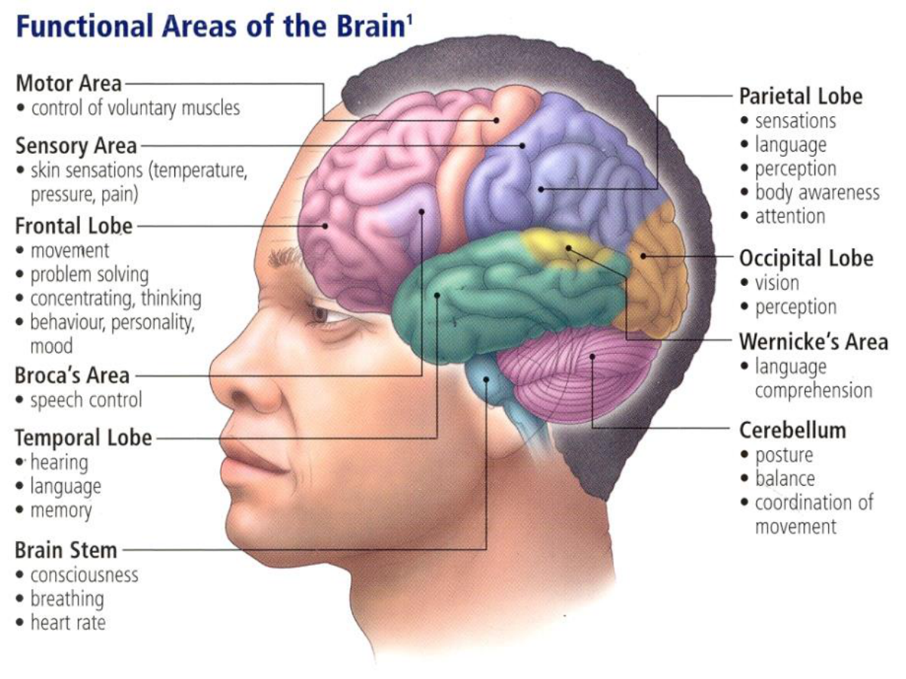
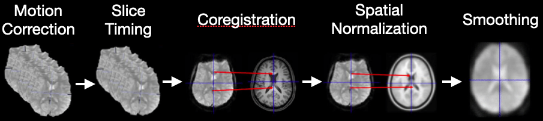
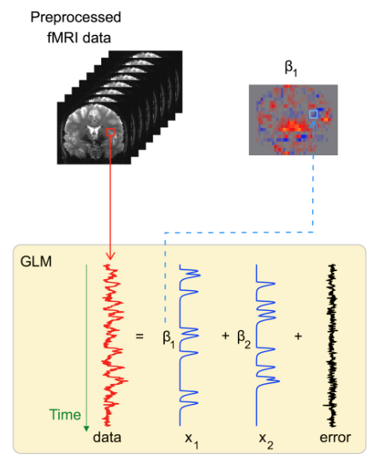
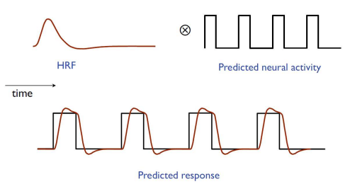
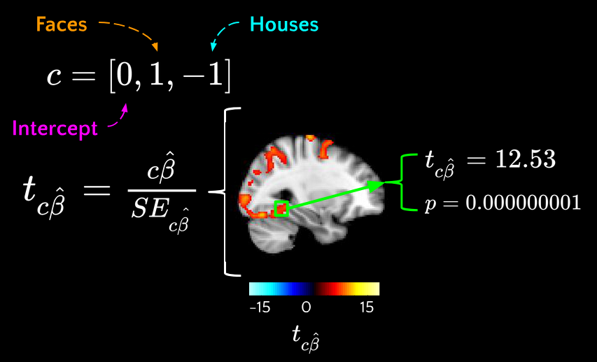

# Introduction to the Seminars

For fMRI analysis, we need a whole set of tools — **Nipype, FSL, AFNI**, and other packages.  
To avoid problems with environment setup and to save time, we use a **Docker container**.  
This guarantees that everyone has the same environment and that results are reproducible.

As our dataset, we use the classic **test–retest fMRI dataset [ds000114](https://www.openfmri.org/dataset/ds000114/)**.  
It includes **ten healthy middle-aged volunteers** who were scanned twice, with a few days between sessions.  

During scanning, the participants performed:
- motor tasks (*finger, foot, and lip*),  
- language tasks (*word generation and repetition*),  
- a spatial task (*landmark task*).  

In addition, **structural data** (DTI, T1-weighted) were collected.  
This dataset was specifically created to check reproducibility and to test fMRI analysis methods, so it is often used in educational materials.

# Preprocessing

Functional MRI data cannot be analyzed in raw form. Before we can run statistical models, we need to **prepare the data**.  
The goal of preprocessing is to remove noise and artifacts, align the data to anatomy, and make the results comparable across subjects.

---

## Why do we preprocess?
- fMRI volumes are collected slice by slice, not instantaneously → we need **slice-timing correction**.  
- Subjects inevitably move in the scanner → we need **motion correction**.  
- Functional images have lower spatial resolution than anatomical scans → we need **coregistration** to map them correctly.  
- Brain activity is distributed across space and noisy → we apply **smoothing**.  
- Some volumes are corrupted by sudden motion or scanner noise → we perform **artifact detection**.

Without these steps, the statistical analysis would be unreliable and hard to interpret.

---

## How do we preprocess?
We build a **workflow in Nipype** that combines tools from [FSL](https://nipype.readthedocs.io/en/latest/users/examples/fmri_fsl.html) and [SPM](https://nipype.readthedocs.io/en/latest/users/examples/fmri_spm.html):  

1. **ExtractROI** – remove unstable “dummy scans”.  
2. **MCFLIRT** – correct for head motion.  
3. **SliceTimer** – adjust for acquisition delays between slices.  
4. **Coregistration workflow** – align functional data with anatomy (skull-stripping, segmentation, FLIRT alignment, BBR refinement).  
5. **Smooth** – apply Gaussian filters.  
6. **ArtifactDetect** – flag volumes with excessive motion or signal changes.  

All steps are connected into a single reproducible pipeline.

---

## What do we get in the end?
After preprocessing, for each subject we obtain:  
- Skull-stripped anatomical scans.  
- Functional data aligned to anatomy, resampled to isotropic voxels.  
- Smoothed functional data (with different kernels).  
- Motion parameters (translations, rotations).  
- Outlier labels and plots for quality control.  

These outputs form the **foundation for first-level statistical analysis** and, later, **group-level modeling**.

# Analysis: 1st & 2nd Level

The goal of analysis is to move from raw time series to interpretable activation maps:
- **1st level (individual analysis):** model each subject separately and ask, *which brain regions respond to the experimental tasks?*
- **2nd level (group analysis):** combine across subjects and ask, *are these effects reliable in the population?*

---

## 1st-Level (Individual) Analysis

After preprocessing, we have fMRI volumes aligned to anatomy, corrected for motion, and smoothed.  But voxel time series still need **statistical modeling** to answer: *where is activity linked to our experimental conditions?* The 1st level builds this link within each subject.

### Core idea (GLM)
Treat each voxel as a separate time series $y(t)$ and model it as a linear combination of predictors:

$$ y = {\beta} X + {\varepsilon} $$

- $y$: observed BOLD signal over time  
- $X$: design matrix (event regressors convolved with HRF, motion, outliers, drifts)  
- $\beta$: regression coefficients (contribution of each variable to the voxel activation)  
- $\varepsilon$: noise component

Parameters are estimated with **ordinary least squares (OLS)** method. 
This step transforms raw signal fluctuations into **activation maps**: images showing where the brain responds to each task.  
At this stage, we can already check whether expected regions “light up” (e.g., motor cortex during foot movements).

### Why we convolve with HRF
The BOLD signal is delayed and smeared by blood flow. If we used raw event timings, our model would miss the shape of the measured response.
Binary event regressors are **convolved with the HRF** to form realistic predictors.

### What we test (contrasts)
The GLM gives us coefficients for each condition. But research questions are rarely about “all betas at once” — they are about **comparisons**:
- Is there any activation for finger movement?  
- Is the foot response stronger than the finger and lips combined?  

Contrasts are the way to formalize these hypotheses. They let us combine coefficients and test targeted questions.  
**The results are statistical maps showing how strongly each hypothesis is supported in each voxel.**

---

## 2nd-Level (Group) Analysis

Individual results are informative, but we usually want to generalize beyond one participant.  
Group analysis answers: *are these effects consistent across subjects, or could they just be idiosyncratic?*

### Model
For each voxel, take the 1st-level **contrast values** from all subjects and run a **one-sample t-test**:

$$ c{\beta}= {\beta}_g X_g + {\eta} $$

- $c{\beta}$ - estimated from 1st level
- $X_g$ - new design matrix (group indicators)
- ${\beta}_g$ - new regression coefficients
- ${\eta}$ - inter-subject variability

Then we can find ${\beta}_g$ and perform hypothesis testing on it

This is a **random-effects** analysis - accounts for inter-subject variance. 
At the group level, we don’t just average. We account for **variability between individuals**. Random-effects models test whether the average effect is reliably different from zero across the sample. This is what allows us to make **population-level conclusions**, rather than only describing our specific participants.

### Normalization
Brains differ in size and shape. To compare across subjects, we need to bring everyone’s data into a **common reference space** (like the MNI template).  
This way, a “motor cortex voxel” corresponds to the same anatomical location for all subjects.  

## Multiple Comparisons correction
In fMRI we test thousands of voxels at once. Without correction, many “activations” would appear just by chance.  
That’s why we use statistical corrections:
- **FWER (family-wise error rate):** protects against *any* false positives, but can be conservative.  
- **FDR (false discovery rate):** balances sensitivity and error control by limiting the proportion of false positives among significant voxels.  
- **Cluster-based methods:** focus on groups of voxels, reflecting that real brain activity tends to be spatially extended.

---

## What we gain
- At the **individual level**, we map each subject’s brain activity in relation to tasks.  
- At the **group level**, we find effects that are reproducible and meaningful at the population scale.  

Together, these steps turn raw fMRI signals into **scientific evidence** about how the brain responds to controlled experimental conditions.
